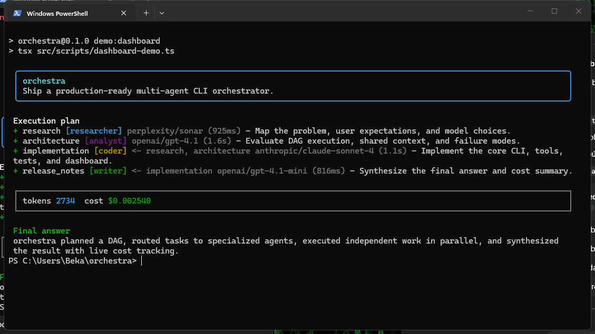

# orchestra

> Connect your OpenRouter account and run any terminal objective through routed AI agents.

[](https://www.typescriptlang.org/)
[](https://nodejs.org/)
[](https://openrouter.ai/)
[](LICENSE)

`orchestra` is an interactive TypeScript/Node.js CLI that lets a user connect their OpenRouter account once, then ask for almost anything: research, coding, analysis, writing, repo work, planning, debugging, or mixed objectives. The Orchestrator builds a JSON DAG, routes each subtask to the best configured agent, the classifier chooses the right model tier, workers run in parallel where possible, and the final answer is synthesized with live terminal visibility.

No Apify. No hidden model providers. Model access and optional web-capable research are OpenRouter-only.



```bash
npx multi-agent-llm connect
npx multi-agent-llm --once "Plan the next release for this repository."
```

The npm package is `multi-agent-llm`; the installed terminal command is still `orchestra`.

## Preview

```txt
orchestra
Explica en una frase que el proyecto CLI orchestra funciona como orquestador multi agente.

Execution plan
+ understand_project [researcher] openai/gpt-4.1-mini (928ms) - Investigar y entender el funcionamiento...
+ write_sentence [writer] <- understand_project openai/gpt-4.1-mini (1.2s) - Redactar una frase...

tokens 2029  cost $0.001461

Final answer
El proyecto CLI orchestra funciona como un orquestador multiagente que coordina y sincroniza diversos agentes mediante una interfaz de linea de comandos.
```

## Architecture

```txt
User objective
     |
     v
+------------------+       +-------------------------+
| Orchestrator     | ----> | Planner JSON DAG        |
| model            |       | tasks + dependencies    |
+------------------+       +-------------------------+
                                     |
                                     v
                         +-------------------------+
                         | Classifier-first route  |
                         | score 1-10 -> tier/model|
                         +-------------------------+
                                     |
                   +-----------------+-----------------+
                   |                                   |
                   v                                   v
         +------------------+                +------------------+
         | Worker agent     |                | Worker agent     |
         | researcher/coder |                | analyst/writer   |
         +------------------+                +------------------+
                   |                                   |
                   +-----------------+-----------------+
                                     v
                         +-------------------------+
                         | SharedContext          |
                         | in-memory blackboard   |
                         +-------------------------+
                                     |
                                     v
                         +-------------------------+
                         | Final synthesis        |
                         | answer + cost summary  |
                         +-------------------------+
```

The executor emits typed events (`plan:ready`, `task:start`, `task:done`, `task:failed`, `cost:update`, `final:answer`). The Ink dashboard subscribes to those events, so orchestration logic is not coupled to UI rendering.

## Features

- Interactive CLI prompt with `/config` and `/exit`.
- `orchestra connect` onboarding for OpenRouter API keys.
- Orchestrator planner that must return schema-validated JSON before execution.
- Planner sees the configured agent roster and activates the best agent for each subtask.
- DAG executor with dependency ordering and parallel independent tasks.
- Retry-once behavior for failed agents.
- SharedContext blackboard for cross-agent results.
- Classifier-first model routing with configurable tiers.
- Tool-calling loop in `BaseAgent`.
- Sandboxed filesystem tools: `read_file`, `write_file`, `list_dir`.
- Confirmed shell tool: `run_command` never executes without user confirmation.
- Optional OpenRouter-backed `web_scrape` research tool using a configured web-capable model.
- Live Ink dashboard with status, active model, token count, and cost.
- Offline deterministic demo for presentations and tests.

## Install

```bash
git clone <your-repo-url>
cd orchestra
npm install
npm run build
npm link
orchestra connect
orchestra
```

For local development:

```bash
npm test
npm run demo
node dist/index.js
```

## Configuration

Create `orchestra.config.json` or use environment variables. Start from:

```bash
orchestra connect
```

For env-based setup:

```bash
orchestra connect --key-env OPENROUTER_API_KEY
```

Or start from the example file:

```bash
cp orchestra.config.example.json orchestra.config.json
```

Example:

```json
{
  "openrouterApiKey": "env:OPENROUTER_API_KEY",
  "orchestratorModel": "anthropic/claude-opus-4",
  "classifierModel": "openai/gpt-4.1-mini",
  "webResearchModel": "perplexity/sonar",
  "agents": {
    "researcher": {
      "model": "perplexity/sonar",
      "webModel": "perplexity/sonar",
      "tools": ["web_scrape"]
    },
    "coder": {
      "model": "anthropic/claude-sonnet-4",
      "tools": ["read_file", "write_file", "list_dir", "run_command"]
    },
    "analyst": { "model": "openai/gpt-4.1" },
    "writer": { "model": "openai/gpt-4.1-mini" },
    "generalist": { "model": "openai/gpt-4.1-mini" }
  },
  "tierThresholds": { "tier1": 3, "tier2": 6 },
  "tierModels": {
    "tier1": "openai/gpt-4.1-mini",
    "tier2": "openai/gpt-4.1",
    "tier3": "anthropic/claude-opus-4"
  }
}
```

Recommended OpenRouter web-capable research models:

- `perplexity/sonar`
- `openai/gpt-4o-search-preview`
- `google/gemini-2.0-flash-exp`

If no `webResearchModel` or researcher `webModel` is configured, `web_scrape` stays disabled and returns a clear message instead of calling another provider.

## Usage

Connect OpenRouter:

```bash
orchestra connect
```

Interactive mode:

```bash
node dist/index.js
```

One-shot objective:

```bash
node dist/index.js --once "Audit this repository and propose the next engineering milestone."
```

Override the orchestrator model for one run:

```bash
node dist/index.js --model anthropic/claude-sonnet-4 --once "Draft a release plan."
```

Offline demo:

```bash
npm run demo
```

Animated dashboard demo, designed for recording:

```bash
npm run demo:dashboard
```

Record it for the README:

```bash
asciinema rec demo.cast -c "npm run demo:dashboard"
agg demo.cast demo.gif
```

OpenRouter connectivity check:

```bash
npm run openrouter:ping
```

## Tool Safety

Filesystem tools are sandboxed to the current project root. Paths that resolve outside the root are rejected.

`run_command` always asks for confirmation through an interactive prompt before running. If the user declines, the tool returns `Command cancelled by user.`

## Development

```bash
npm test
npm run build
npm audit --audit-level=moderate
```

The build uses `tsconfig.build.json` so tests do not ship into `dist`.

## Project Structure

```txt
src/
  agents/          BaseAgent, WorkerAgent, registry
  providers/       OpenRouter client
  tools/           sandboxed filesystem, shell, OpenRouter-backed research
  ui/              Ink dashboard
  classifier.ts    task complexity routing
  planner.ts       objective -> JSON DAG
  executor.ts      DAG execution + retries + events
  bus.ts           SharedContext blackboard
  events.ts        typed event emitter
  orchestrator.ts  planning -> execution -> synthesis
  index.ts         CLI entrypoint
```

## Contributing

1. Keep TypeScript strict.
2. Write failing tests before behavior changes.
3. Do not add non-OpenRouter model gateways.
4. Keep tools explicit, sandboxed, and user-confirmed where they can affect the machine.
5. Run `npm test`, `npm run build`, and `npm audit --audit-level=moderate` before opening a PR.

## License

MIT
